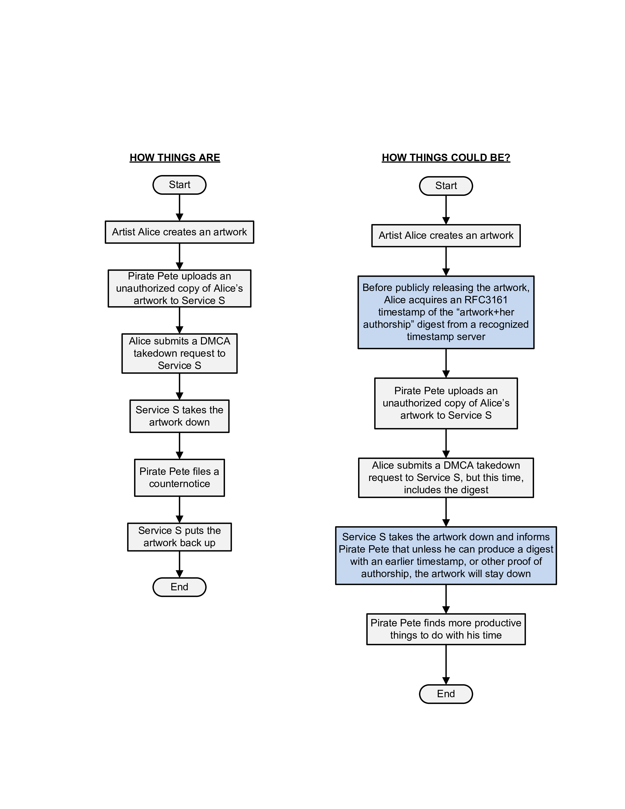
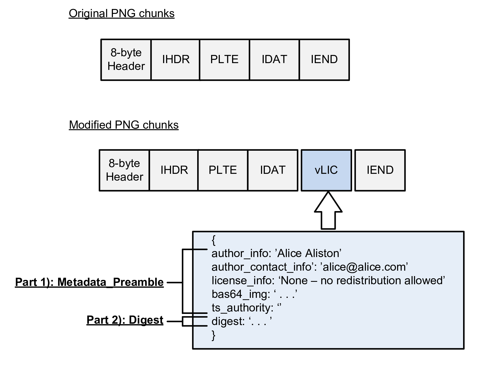
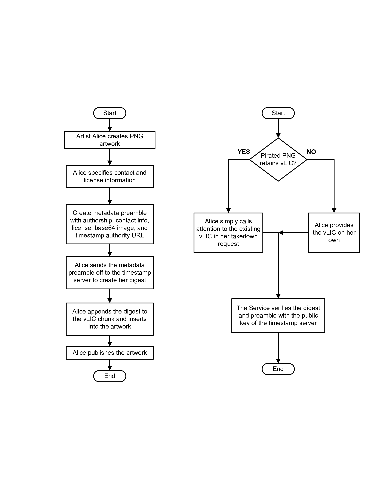

# Art_Stamp
RFC3161 demonstration to simplify DMCA takedown compliance

# What's the problem?

This repo is intended more as a conversation starter than a proper project.

In general, I don't understand why media services and artists don't employ <a target="_blank" href="https://datatracker.ietf.org/doc/html/rfc3161">RFC3161 timestamps</a> to simplify their DMCA compliance.  RFC3161 timestamps are regularly used to authenticate the creation date of an asset. Basically, you reach out to a timestamp server with your data, say "server, please bless this data with your private key including the time at which you did so", the server so blesses, including an indication of the time, and provides you back the signed digest.  Later, if someone wants to confirm that that data existed on that date, then they just verify the digest with the server's public key.

As shown on the flow diagram on the left, many DMCA takedown requests are ineffective because the server doesn't have a good way to distinguish false from genuine counter notices (though not shown, the converse issue is also common, where a malicious request [despite penalty of purgery] is made and the service takes down legitimate artwork).  Basically, the service's position is "How do I know which of you is the true owner?  Absent proof, I'm going to arbitrarily retain or reject the upload (perhaps as best suits my businss model)."

</img>

Why don't we do things instead as in the flow diagram on the right, particularly as indicated in the blue boxes?  Why don't artists, or the graphics programs / scanning programs they use, make a regular habit of creating (and possibly appending) timestamp verifications to the artwork? 

I may just be ignorant, but every day I feel like I see stories, e.g., on <a target="_blank" href="https://torrentfreak.com/">TorrentFreak</a> that such a habit would readily resolve.  This is hardly a new concept, so I'm not sure why it's not more widespread.  RFC 3161 has been around since 2001 and I know folks have authenticated artwork and other assets before.

# How an Art_Stamp could be structured in a PNG

I'm particularly fond of the PNG format for its elegance and simplicity.  

As indicated below, PNGs are just a serial collection of byte "chunks."  You can add an arbitrary number of chunks of your own to the file and it'll still be readable.  

</img>

So, as indicated in the lower portion, why not always add a chunk at creation, I call the vLIC chunk (i.e., "verify licensing").

vLIC is just JSON text including two portions:  a) a metadata preamble; and b) the timestamp digest of the metadata preamble.  Now, the PNG will "self authenticate" to any downstream recipient.  The metadata preamble includes a base64 copy of the image being authenticated (before you cry "bloat!" where this is identical with the data in the IDAT, I believe the compression reduces it to a pretty trivial size.  Admittedly, that may not be true if IDAT is subsequently modified).  

The artist doesn't <i>have</i> to include the vLIC in the published file if they're worried about bloat, so long as they retain their own copy for use in takedown requests.  As discussed below, though, having vLIC in the file may simplify things.

## Deployment Walkthrough

In the following diagram, creation occurs in the process on the left and verification on the right.

</img>

On the left, Alice basically creates her artwork, creates her preamble, has the preamble signed, and then records the resulting digest (either in the artwork itself with the vLIC chunk described above, saves a standalone vLIC, etc.).

Later, as shown on the right, when Alice issues a takedown request, if (as may often be the case) the pirate was too lazy to remove the vLIC chunk, then Alice can simply call the service's attention to the chunk in the as-uploaded copy.  

# Variations

Clearly you can make this more sophisticated / complicated.  For example, you could create nested vLIC digests to show a chain of title under various sublicenses, as well as the creation of derivative works.

Similarly, if artist identity becomes a concern, then the "authorship info" in the vLIC could itself be a digest signed wtih Alicen's private key and then unsigned with her public key.  I'm not sure this would be necessary in most cases though (a verified vLIC will already attest to the validity of the author_contact field).  The nice thing about the PNG chunks, etc., is that the artis / graphics software, can be as creative as they want with the vLIC.  They just need to provide instructions to the service with their takedown request.

# FAQ / Objections

## "What if someone modifies the image?  Won't it take the service forever to manually compare?"

There are plenty of image similarity algorithms out there that services (certainly by now) should be employing on a regular basis.  Comparing the uploaded image with the base64 decode should allow most de minimis modified files (rotation, scaling, etc.) to be readily recognized.
