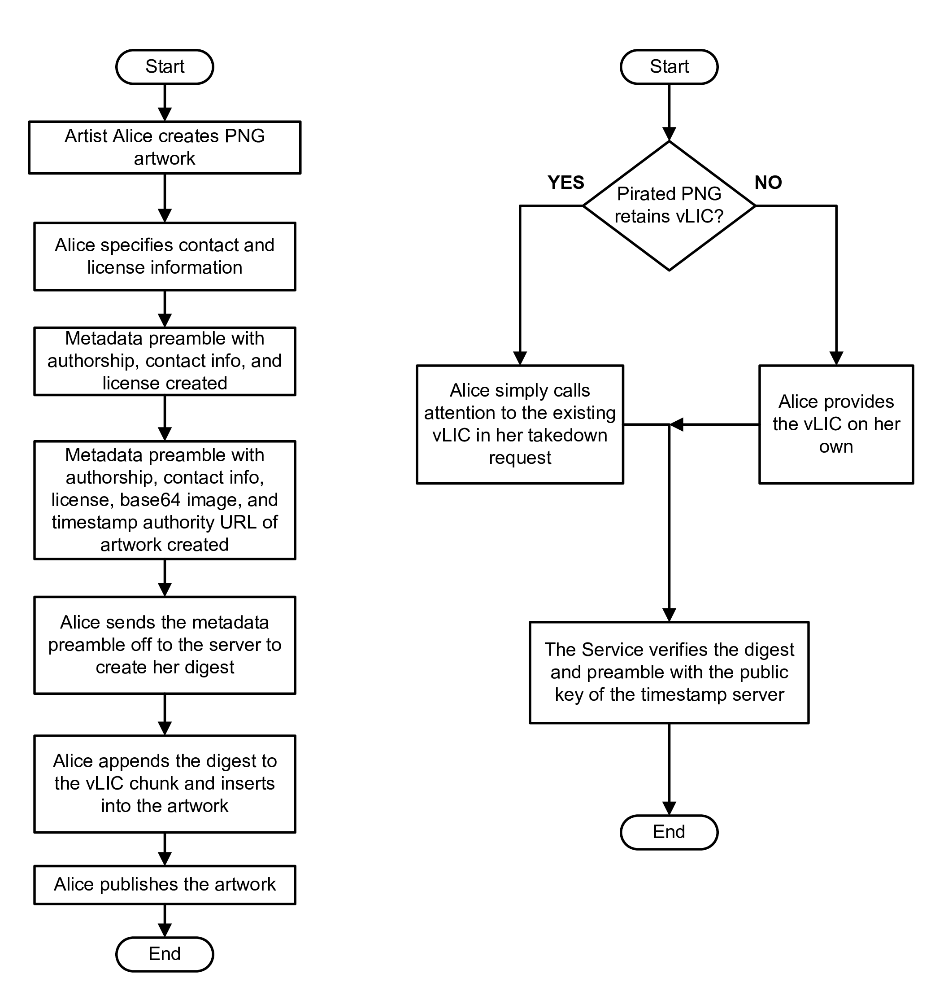

# Art_Stamp
RFC3161 demonstration to simplify DMCA takedown compliance

# What's the problem?

This repo is intended more as a conversation starter than a proper project.

In general, I don't understand why media services and artists don't employ <a target="_blank" href="https://datatracker.ietf.org/doc/html/rfc3161">RFC3161 timestamps</a> to simplify their DMCA compliance.  RFC3161 timestamps are regularly used to authenticate the creation date of an asset. Basically, you reach out to a timestamp server with your data, say "server, please bless this data with your private key including the time at which you did so", the server so blesses, including an indication of the time, and provides you back the signed digest.  Now, 

</img>

# How an Art_Stamp could be structured in a PNG

</img>

# Deployment Walkthrough

</img>

# Variations

Clearly you can make this more sophisticated / complicated.  For example, you could create nested vLIC digests to show a chain of title under various sublicenses, as well as the creation of derivative works.

# FAQ / Objections

## What if someone modifies the image?

Clearly you can mak
